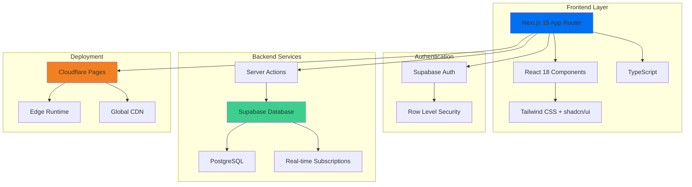
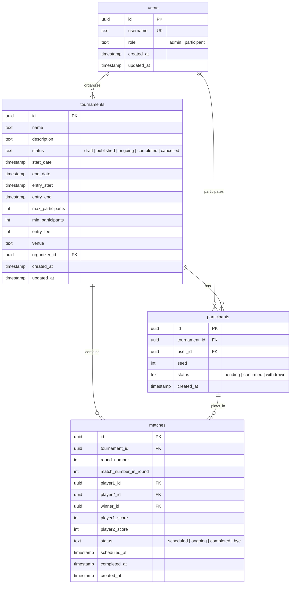
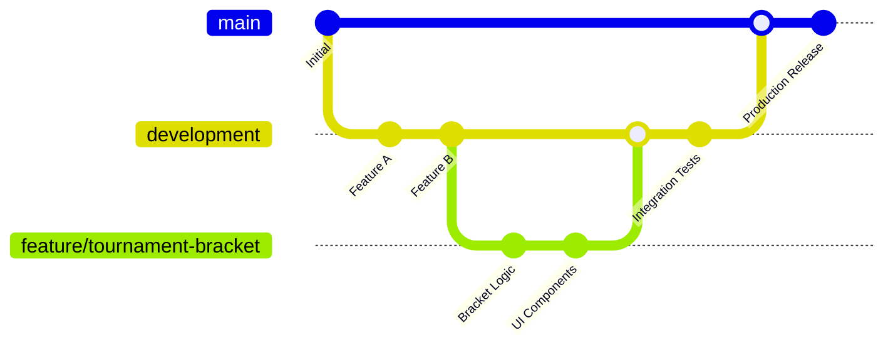

# Tournament Management System

<p align="center">
  
  
  
  
</p>

<p align="center">
  <strong>現代的なWebテクノロジーで構築された、シンプルで効率的なトーナメント管理システム</strong>
</p>

## 🏆 システム概要

Tournament Management Systemは、スポーツ大会、eスポーツトーナメント、コンテストなど様々な競技イベントの運営を支援するWebアプリケーションです。主催者は簡単に大会を作成・管理でき、参加者は直感的に参加登録や試合状況の確認ができます。

### 🎯 主要な特徴

- **🏅 包括的な大会管理**: 大会作成から結果発表まで一元管理
- **👥 ユーザーフレンドリー**: 直感的なUIで誰でも簡単に操作可能
- **⚡ リアルタイム更新**: 試合結果や順位表がリアルタイムで反映
- **📱 レスポンシブ対応**: PC・タブレット・スマートフォンで最適表示
- **🔒 セキュア**: Supabase認証による安全なユーザー管理
- **☁️ クラウドネイティブ**: Cloudflare Pagesによる高速で安定したホスティング

## 🚀 実装済み機能

### 👤 ユーザー管理
- **認証システム**: メール認証による安全なログイン・登録
- **ロール管理**: 管理者・参加者の権限分離
- **プロフィール管理**: ユーザー情報の編集・更新

### 🏟️ 大会管理
- **大会作成**: 名前、説明、開催日、参加費、会場などの詳細設定
- **参加者管理**: 参加登録の受付、承認、キャンセル処理
- **ステータス管理**: 下書き → 公開 → 進行中 → 完了のライフサイクル管理

### 🏆 トーナメント機能
- **ブラケット生成**: シングルエリミネーション方式の自動対戦表作成
- **試合結果入力**: スコア記録と勝者決定
- **進行管理**: 勝者の自動進出と次回戦への反映
- **視覚的表示**: 美しいトーナメント表での進行状況表示

### 📊 ダッシュボード
- **統計情報**: 参加者数、試合進行状況の可視化
- **大会一覧**: 主催・参加大会の一元管理
- **リアルタイム更新**: 最新情報の自動反映

## 🏗️ システムアーキテクチャ



## 📋 データベース設計



## 🔧 技術スタック

### Frontend
- **Framework**: Next.js 15 (App Router)
- **Language**: TypeScript 5.0
- **UI Library**: React 18
- **Styling**: Tailwind CSS
- **Components**: shadcn/ui, Radix UI
- **Icons**: Lucide React
- **Notifications**: Sonner

### Backend
- **Database**: Supabase (PostgreSQL)
- **Authentication**: Supabase Auth
- **API**: Next.js Server Actions
- **Real-time**: Supabase Subscriptions
- **Security**: Row Level Security (RLS)

### DevOps & Deployment
- **Hosting**: Cloudflare Pages
- **Runtime**: Edge Runtime + Node.js
- **CI/CD**: GitHub Integration
- **Environment**: Production/Development 分離

## 🚀 導入手順

### 前提条件
- Node.js 18.0 以上
- npm または yarn
- Supabase アカウント
- Cloudflare アカウント（デプロイ時）

### 1. リポジトリのクローン
```bash
# 開発ブランチをクローン（推奨）
git clone -b development https://github.com/zono-zono/tournament-system.git
cd tournament-system

# または本番ブランチ
git clone https://github.com/zono-zono/tournament-system.git
cd tournament-system
```

### 2. 依存関係のインストール
```bash
npm install
```

### 3. 環境変数の設定
```bash
cp .env.example .env.local
```

`.env.local` に以下を設定：
```bash
NEXT_PUBLIC_SUPABASE_URL="your-supabase-url"
NEXT_PUBLIC_SUPABASE_ANON_KEY="your-supabase-anon-key"
```

### 4. データベースの設定
Supabase ダッシュボードで以下のSQLを実行：
```sql
-- 詳細なマイグレーションファイルは supabase/migrations/ を参照
-- または開発環境設定手順のSQLを実行
```

### 5. 開発サーバーの起動
```bash
npm run dev
```

ブラウザで http://localhost:3000 にアクセス

## 🌐 デプロイメント

### 本番環境 (Cloudflare Pages)
1. Cloudflare Pages プロジェクトを作成
2. GitHub リポジトリを連携（mainブランチ）
3. ビルド設定:
   - **Framework**: Next.js
   - **Build command**: `npm run pages:build`
   - **Output directory**: `.vercel/output`
4. 環境変数を設定
5. 互換性フラグ `nodejs_compat` を有効化

### 開発環境
- developmentブランチを使用
- 別のSupabaseプロジェクトを作成
- 開発用Cloudflare Pagesプロジェクトを作成

## 🧪 開発ワークフロー



### ブランチ戦略
- **main**: 本番環境デプロイ用
- **development**: 開発統合ブランチ
- **feature/***: 機能開発ブランチ

## 🔮 ロードマップ

### Phase 1: 基本機能 ✅
- [x] ユーザー認証・登録
- [x] 大会作成・管理
- [x] 参加者登録
- [x] シングルエリミネーション トーナメント
- [x] 試合結果入力

### Phase 2: 拡張機能 🚧
- [ ] ダブルエリミネーション形式
- [ ] 総当たり戦（ラウンドロビン）
- [ ] リアルタイム通知
- [ ] 詳細統計・レポート

### Phase 3: 高度な機能 📋
- [ ] チーム戦対応
- [ ] ライブ配信連携
- [ ] モバイルアプリ
- [ ] API公開

## 🤝 コントリビューション

1. このリポジトリをFork
2. feature/your-feature-name ブランチを作成
3. 変更をコミット
4. プルリクエストを作成

## 📝 ライセンス

MIT License - 詳細は [LICENSE](LICENSE) ファイルを参照

## 🆘 サポート

- 🐛 バグ報告: [GitHub Issues](https://github.com/zono-zono/tournament-system/issues)
- 💡 機能要望: [GitHub Discussions](https://github.com/zono-zono/tournament-system/discussions)
- 📖 ドキュメント: [Wiki](https://github.com/zono-zono/tournament-system/wiki)

---

<p align="center">
  Made with ❤️ for the tournament community
</p>